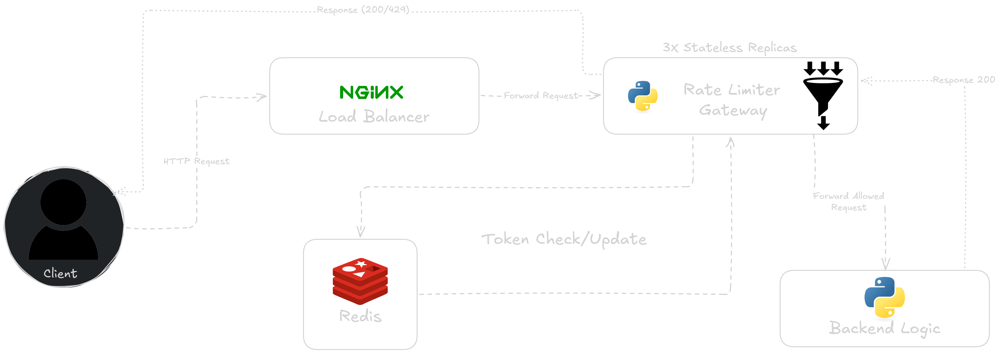
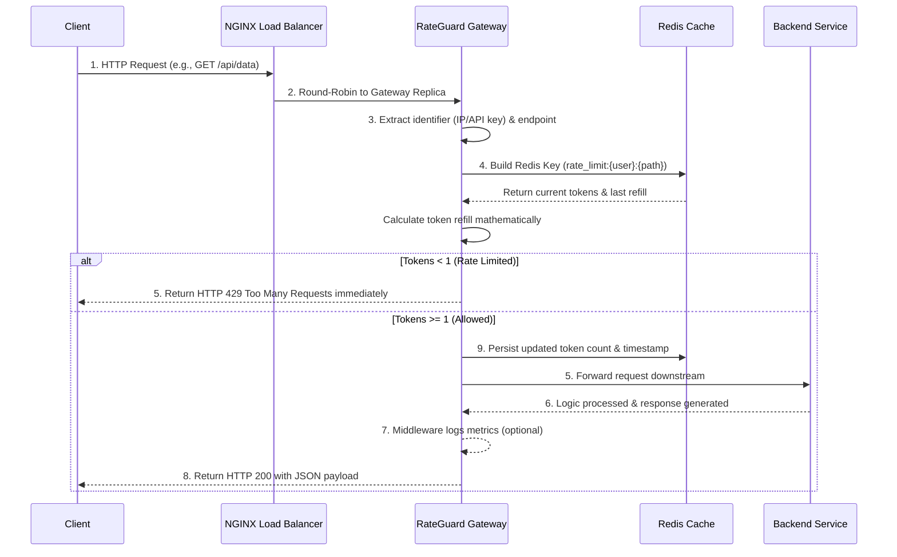

# SYSTEM-ARCHITECTURE-PROJECT-02 RateGuard - Distributed API Gateway with Rate Limiting

---

## Table of Contents
1. [System Architecture](#system-architecture)
2. [Folder Structure](#folder-structure)
3. [Technology Stack](#technology-stack)
4. [Component Design Reasoning](#component-design-reasoning)
5. [Request Flow Logic](#request-flow-logic)
6. [Prerequisites & Output](#prerequisites--output)
7. [Deployment Guide](#deployment-guide)
8. [API Endpoints](#api-endpoints)

---

## System Architecture
The core philosophy revolves around enforcing scalable, distributed rate limits across multiple stateless gateway instances, utilizing a centralized in-memory datastore to track token metrics without blocking the critical request proxy path.



---

## Folder Structure
The repository is divided into discrete microservices ensuring separation of concerns:

```text
SAP02 - Rate Limiter/
├── .env                     # Environment variables configuration
├── docker-compose.yml       # Production-ready compose configuration
├── LICENSE                 
├── README.md                # System documentation
├── run_tests.sh             # Shell script for running burst and load balance tests
├── backend/                 # Simulated business logic servers
│   ├── app.py               # Mock API returning container replica hostnames
│   ├── Dockerfile           # Backend containerization strategy
│   └── requirements.txt     # Python dependencies
├── docs/                    # Image assets
│   ├── docker compose ps.png
│   ├── SAP02-Architecture.png
│   └── test output.png
├── nginx/                   # Reverse proxy configuration
│   └── nginx.conf           # Load balancing strategy and Docker DNS resolution
├── rateguard/               # The core Python API Gateway & Middleware
│   ├── app.py               # Main Flask application and routing
│   ├── config.py            # Environment configurations
│   ├── Dockerfile           # Gateway containerization strategy
│   ├── middleware.py        # Token Bucket algorithm and Redis state logic
│   ├── proxy.py             # Downstream request forwarding system
│   ├── requirements.txt     # Python dependencies
│   └── token_bucket.lua     # Atomic Redis Lua script for rate limiting
└── tests/                   # Analytics and validation scripts
    ├── burst_test.py        # Validates rate-limiter Token Bucket capacity
    └── load_balance_test.py # Confirms NGINX round-robin functionality
```

---

## Technology Stack

### Gateway & Backend 
* **Python (Flask)**: Extremely lightweight WSGI web application framework utilized for rapid HTTP intercept and reverse proxy processing.
* **Gunicorn**: Industrial-grade Python WSGI HTTP server executing the Flask applications in concurrent multi-worker environments to handle intense load operations.
* **Requests**: Standard HTTP library used for smoothly piping client payloads directly to backend endpoints.

### State & Routing
* **Redis**: Immensely fast in-memory key-value data store selected for its atomic operations, acting as the singular source of truth for rate limiting configurations and concurrent token calculations.
* **NGINX**: High-performance asynchronous edge proxy dynamically resolving Docker container DNS to automatically load balance client traffic across dynamically scaling gateway replicas.
* **Docker Compose**: Containerization module streamlining the infrastructure mapping, enabling flawless deployment using the internal Compose network and `deploy: replicas` replication factor logic.

---

## System Design Concepts

### 1. Token Bucket Algorithm
The system utilizes the classic **Token Bucket Algorithm** to control burst traffic while maintaining sustained velocity. A dynamic mathematical simulation replenishes available capacity iteratively upon each isolated interaction, flawlessly limiting usage spikes.

### 2. Stateless Services
RateGuard gateways are completely stateless. Each replica processes inbound connections independently and delegates all rate-limit tracking to a centralized Redis cache. This prevents isolated memory fragmentation and ensures rate limits are applied fairly regardless of which gateway replica receives the request.

### 3. Horizontal Scaling
By decoupling the state (Redis) from the compute (RateGuard), the system seamlessly enables horizontal scaling. New gateway replicas can be spun up dynamically via Docker Compose, and NGINX's internal DNS resolution will automatically begin routing traffic to them.

### 4. Consistency vs Performance
To prevent users from exploiting race conditions during concurrent request bursts, RateGuard utilizes atomic **Redis Lua Scripts**. This mathematically guarantees that no two threads can evaluate and deduct a single token simultaneously, ensuring strict rate limit enforcement at scale.

### 5. Middleware & Proxy Logic
A lightweight Flask `@before_request` middleware intercepts incoming traffic to validate token availability. If approved, the payload is transparently forwarded downstream via the proxy utility; if denied, the request is halted immediately at the gateway level.

### 6. API Contracts
The system enforces strict HTTP response standards: denied actions immediately return an `HTTP 429 Too Many Requests` error, whereas successful requests pass through to the backend, returning the backend's JSON payload along with diagnostic replica metadata.

### 7. Failure Handling
High availability is achieved through a **Fail‑Open** strategy. If the Redis cache goes offline or times out, the gateway catches the exception and gracefully permits traffic to pass through. This prioritizes continuous user access over strict rate limit enforcement during partial outages.

### 8. Load Balancing
As the single entry point, **NGINX** proxies external traffic across the internal Docker network. It utilizes a Round-Robin distribution methodology, efficiently balancing connections across all active RateGuard gateway replicas.

### 9. Testing
Custom Python CLI scripts are provided to simulate concurrent traffic bursts and sequential load distribution. These scripts validate that the RateGuard token bucket correctly throttles excess requests (HTTP 429) and that NGINX successfully round-robbins traffic across all backend replicas.

---

## Request Flow Logic



### 1. Connection Intercept
The Client sends an initial HTTP request to a target path (e.g., `GET /api/data`). 

### 2. NGINX Ingress Routing
NGINX receives the external request and actively chooses a specific RateGuard gateway instance utilizing an internal Docker DNS Round-Robin strategy.

### 3. Payload Parsing
The selected RateGuard instance intercepts the connection natively, extracting the identifying client footprint (such as the true IP parsed from headers or an API key) alongside the requested endpoint.

### 4. Middleware Token Execution
The modular `check_rate_limit` middleware engages:
1. It systematically builds the exact string mapping: `rate_limit:{user_id}:{endpoint}`.
2. It queries Redis for the specific bucket state (tokens & timestamp).
3. In-memory mathematics instantly calculate new token regeneration based sequentially on the elapsed time delta.

### 5. Throttle Decisioning
The gateway explicitly bifurcates based on the newly calculated token state:
* **If capacity is exhausted (<1)**: RateGuard intercepts and kills the proxy chain natively, instantly returning a `429 Too Many Requests` JSON response.
* **If authorized (≥1)**: The gateway securely decrements exactly 1 token and authorizes the proxy downstream.

### 6. Backend Processing
The authorized connection flows seamlessly into the internal execution zone. A discrete **Backend Service Replica** captures the input and generates the application payload (e.g., `{"message": "Hello from backend 2"}`).

### 7. Telemetry & Middleware Return
The backend explicitly returns the completed JSON block structurally to the originating RateGuard gateway, where the middleware sequence captures it temporarily for logging metrics or system validations.

### 8. Response Hand-Off
RateGuard transparently ejects the identical HTTP response synchronously back to the exact initial client footprint, accompanied cleanly by an `HTTP 200 OK` header block.

### 9. State Persistence
Simultaneous to the transaction processing natively, Redis organically synchronizes the new decremented token capacity securely, preparing actively for subsequent rapid sequence interactions.

---

## Prerequisites & Output
To execute the infrastructure mapping, your local environment requires:
* Docker Engine (v24.0 or newer)
* Docker Compose Module (v2.0 or newer)
* Port `8080` clear of localized bindings

---

## Deployment Guide
The entire structural framework actively provisions precisely out of the box dynamically leveraging Docker Compose.

1. Clone the repository framework locally.
2. Validate Docker Engine core variables.
3. Natively execute the container build script completely within the repository base:
   ```bash
   docker compose up --build -d
   ```
4. Access the unified backend API cleanly mapped via the edge proxy:
   `http://localhost:8080/api/info`

---

## API & Testing Diagnostics

### Burst Diagnostics
Simulates aggressive parallel concurrent requests natively testing the architectural burst limitations.
```bash
python tests/burst_test.py
```
*Outputs an optimized color-coded log physically marking exactly which threads legally claimed tokens versus which interactions were violently throttled.*

### Telemetry Load Balance Mapping
Generates linear, sequential requests analyzing how internal routing shifts the backend response nodes asynchronously.
```bash
python tests/load_balance_test.py
```
*Visually renders the distinct dynamic hostname variables returned by discrete Docker backend replicas, technically validating the networking flow distribution.*

## Images

Below are the screenshots and outputs captured during development and testing.


